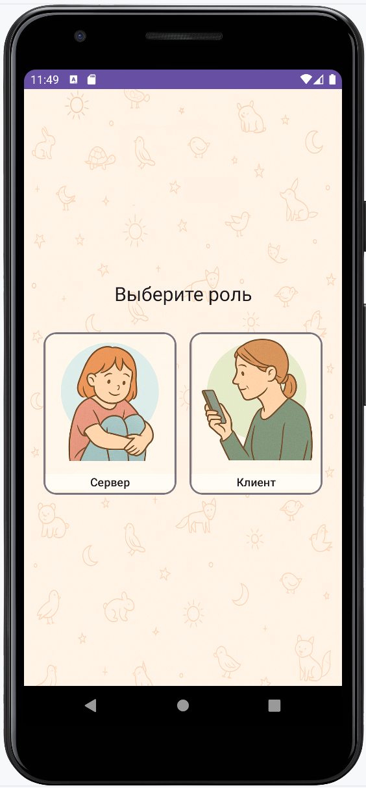
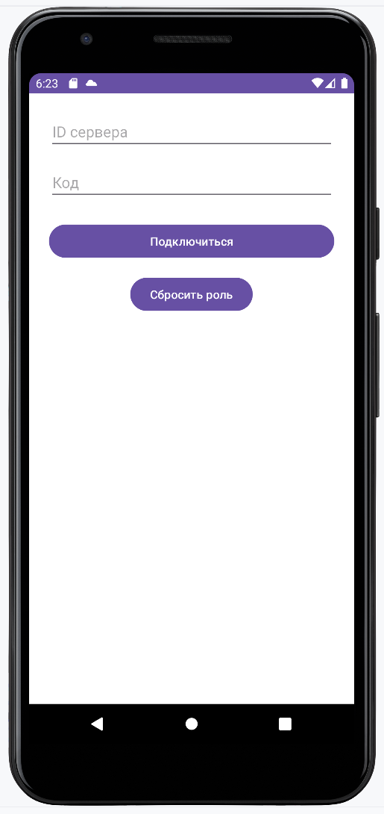
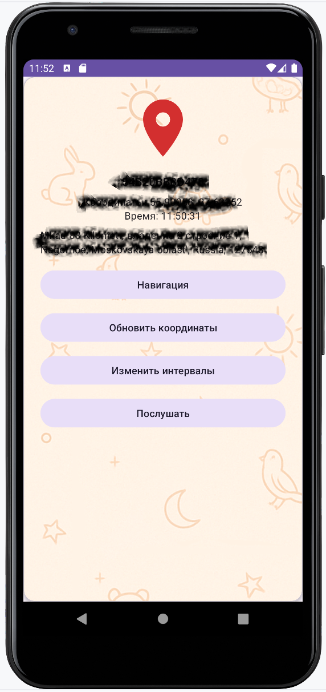
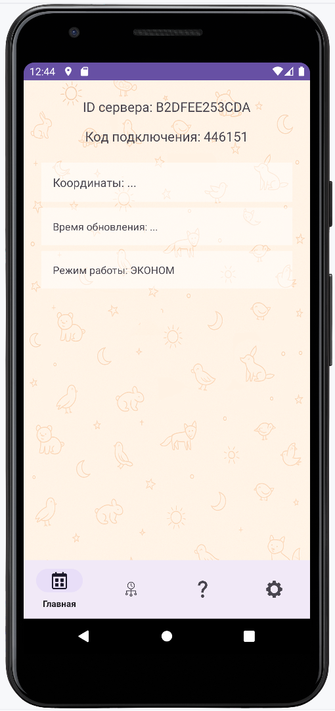
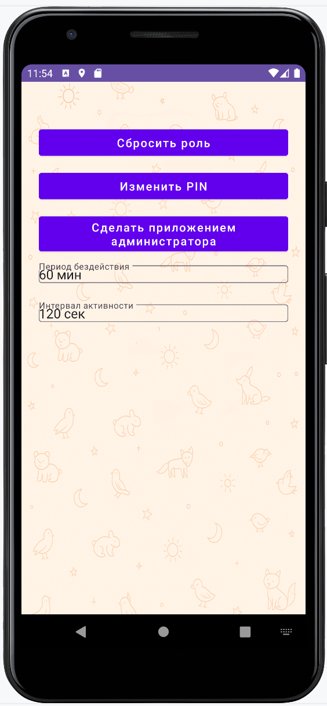
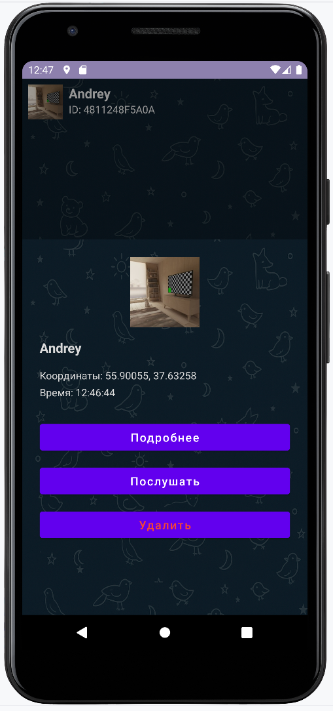
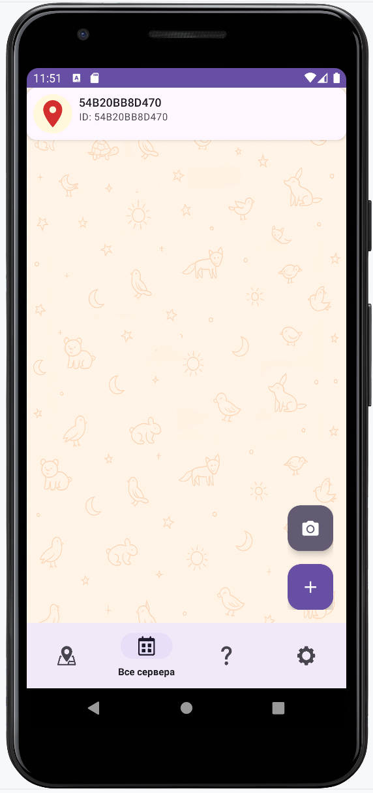

# SafeOrbit v.1.6.8

**⚠️ Attention!**
In the current version, there is an issue with audio streaming on Android 14.
Unfortunately, it has not been resolved yet.
This is due to new privacy restrictions at the OS level.
I may find a solution in the future. ))

[](https://github.com/your-username/safeorbit/actions)
[](LICENSE)
[](https://developer.android.com/)
[](https://kotlinlang.org/)

**SafeOrbit**  is a Kotlin-based Android application for secure, real-time interaction between two devices using Firebase. One device acts as a **Server*** (typically a child's device), and the other as a **Client** (typically a parent's device). Designed for privacy-conscious families, SafeOrbit enables location tracking, activity monitoring, and audio streaming — all under user control.

---

## ✨ Features

- 🔐 Role-based mode: choose Server or Client at first launch
- 📍 Real-time location tracking with smart update logic (motion/activity-aware)
- 🎤 One-way audio broadcasting from Server to Client (with permissions)
- 🧠 Hourly activity logging: steps, distance, movement mode (Eco/Active)
- 📱 Firebase-powered pairing using server ID and Code, or scanning a QR code
- 📷 Assign custom server icons from gallery or camera
- 🗺️ Navigate to server location (via Google Maps or Yandex Maps)
- 🎛️ Fully configurable server intervals (active/inactive update rates)
- 🛡️ PIN-protected server settings & role switch
- 🔐 Device owner mode support (via DevicePolicyManager for managed deployment)
- 📊 In-app history screen with visual step and mode data
- 📦 Room Database for local persistence of activity
- 🌗 Full dark/light theme support
- 👥 Multiple servers per client supported
- 🧾 Detailed marker info: address, timestamp, server name, and more
- 📸 Built-in QR code generation & scanning for easy pairing
- 🧩 Modular architecture with ViewModel + Hilt + WorkManager

---

## 📲 Use Cases

- Monitoring a child's or loved one's device location
- Personal safety and awareness
- Lightweight alternative to commercial GPS trackers
- Private and consent-based audio monitoring

---

## 📸 Screenshots

| 🎮 Role Selection              | 📡 Client Mode (Map & Audio)     |
|-------------------------------|----------------------------------|
|    |       |

| 🧾 Server Details in Client     | 🗺️ Server Location on Map        |
|--------------------------------|----------------------------------|
|     |       |

| 🔐 Server Settings (PIN Lock)  | 🛠️ Server Configuration Options |
|--------------------------------|---------------------------------|
|     |      |

| 🌙 Night Mode (Dark Theme)     | 🧾 Server List in Client    |
|--------------------------------|-----------------------------|
|     |  |

---

## 🛠️ Technologies Used

- **Kotlin + MVVM + Hilt** (DI)
- **Firebase Authentication** (anonymous)
- **Firebase Realtime Database** (sync state/commands)
- **Firebase Storage** (optional: audio backup)
- **Room** (local database)
- **WorkManager + ForegroundService** (updates, audio stream)
- **SensorManager** (step detection)
- **Google Maps SDK or Yandex MapKit** (client choice)
- **ZXing QR or MLKit** (QR scanning)
- **View Binding**, Material 3 Design
- **DevicePolicyManager** (optional for device admin mode)

---

## 🚀 Getting Started

### 1. Clone the repository

```bash
git clone https://github.com/wizand0/safeorbit.git
```

### 2. Open in Android Studio
- Open the project in Android Studio
- Make sure your ```google-services.json``` is placed in the app/ folder
- Enter your api key in ```local.properties``` (```YANDEX_MAPKIT_API_KEY=your_key```)

### 3. Set up Firebase
- Enable the following in the Firebase Console:
- **Anonymous Authentication**
- **Realtime Database** (with custom rules)
- **Storage** (optional: for audio files)

## 🔒 Firebase Rules (Example)
```
{
  "rules": {
    "users": {
      "$uid": {
        ".read": "$uid === auth.uid",
        ".write": "$uid === auth.uid"
      }
    },
    "servers": {
      "$serverId": {
        ".read": "auth != null && root.child('servers').child($serverId).child('owner').val() === auth.uid",
        ".write": "auth != null && root.child('servers').child($serverId).child('owner').val() === auth.uid"
      }
    },
    "clients": {
      "$clientId": {
        ".read": "$clientId === auth.uid",
        ".write": "$clientId === auth.uid"
      }
    }
  }
}

```

## 📄 License
This project is open-source and available under the MIT License.

## 🙌 Contributions
Contributions are welcome! Feel free to open issues or submit pull requests. For major changes, please discuss via issues first.