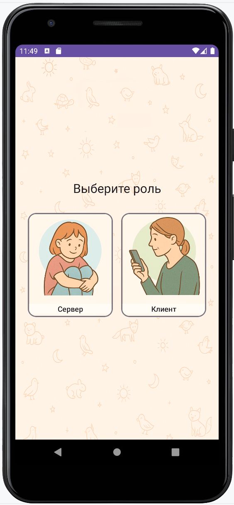
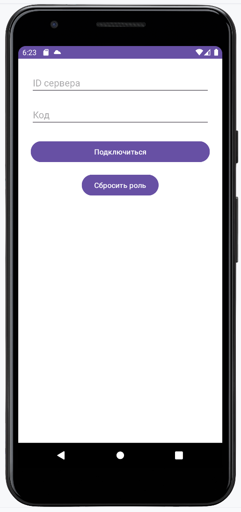
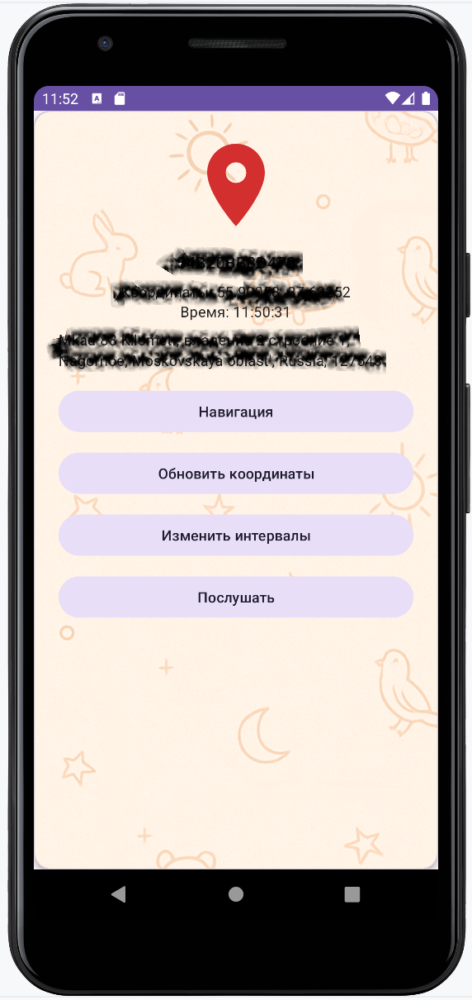
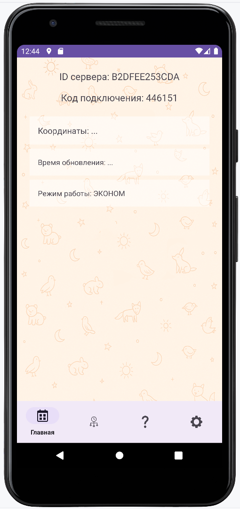
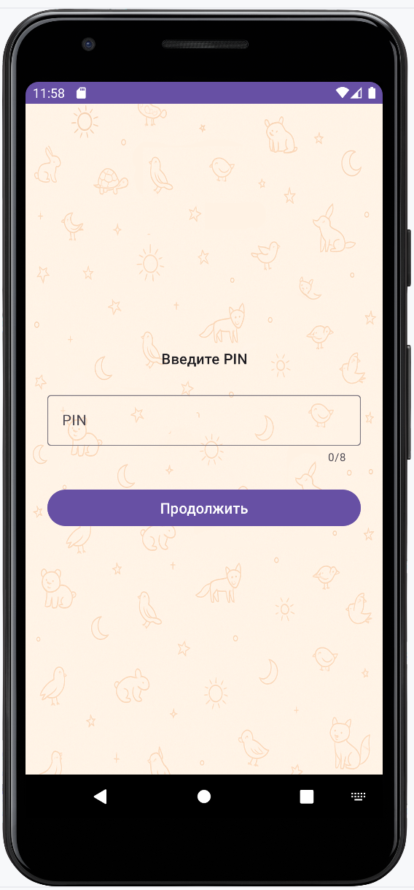
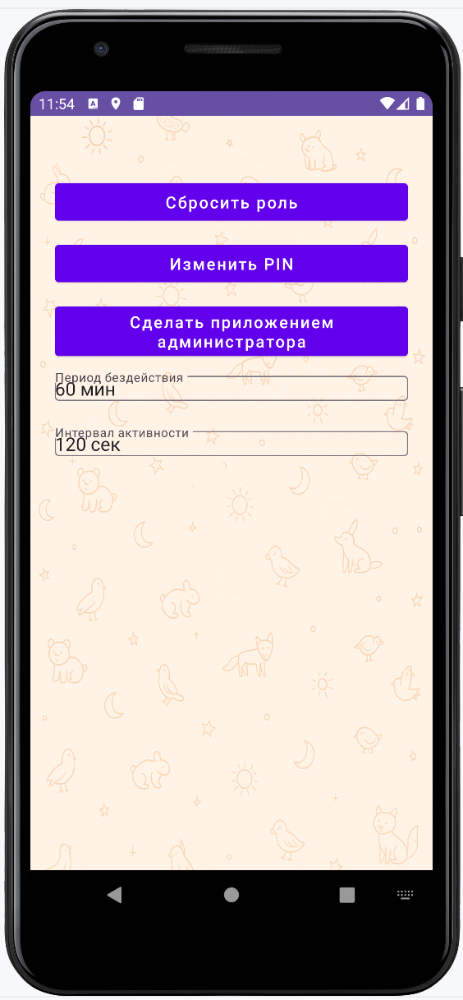
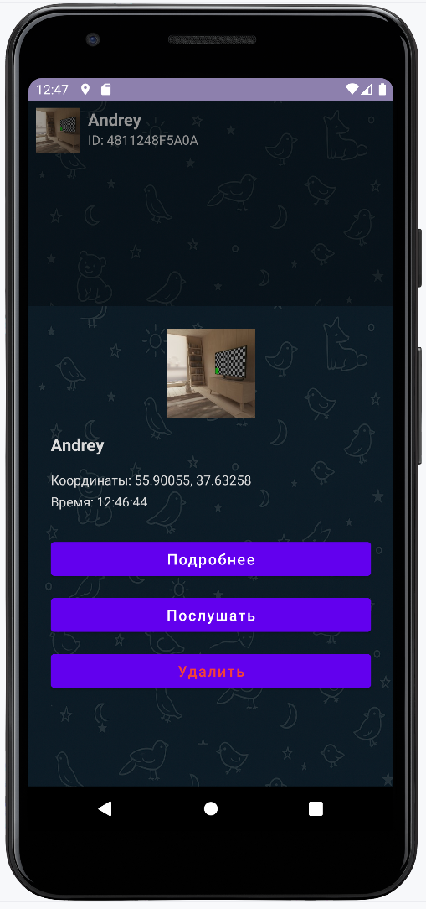
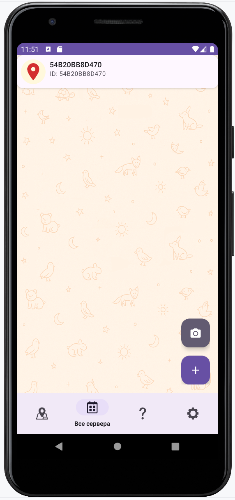

# SafeOrbit v2.1.0

[](https://github.com/wizand0/SafeOrbit/actions)
[](https://developer.android.com/)
[](https://kotlinlang.org/)
[](https://developer.android.com/about/versions/10)
[](https://developer.android.com/about/versions/15)

**SafeOrbit** is a Kotlin-based Android application for secure, real-time interaction between two devices using Firebase Realtime Database. One device acts as a **Server** (the tracked device), and the other as a **Client** (the monitoring device). Designed for privacy-conscious families, SafeOrbit enables location tracking and app-notification monitoring — all under user control.

> Consent-based safety app: the server device owner explicitly pairs with a client and can revoke access at any time.

---

## ✨ Features

### Pairing & roles
- 🔐 Role-based mode: choose Server or Client at first launch
- 📷 Server generates a readable ID plus a one-time **pairing token** (QR code or manual entry)
- 🔄 **Pairing code rotation** — a new 10-minute code can be issued from the QR dialog at any time (used/expired codes are reissued automatically on dialog open)
- 🔒 Token is stored only as a SHA-256 hash in Firebase and is consumed atomically via a transaction
- 👥 Multiple servers per client supported; server can manage connected clients

### Location tracking (Server)
- 📍 Foreground `LocationService` with `FOREGROUND_SERVICE_TYPE_LOCATION` and a persistent notification that reflects the real state (idle / active / just-updated)
- 🧠 Motion-aware update logic: **Active mode** (step-counter driven, fast interval) and **Eco/Idle mode** (WorkManager periodic updates when there is no activity)
- ⚡ On-demand forced update: the client presses "Request update" → a command is written to `server_commands` → the server immediately sends fresh coordinates and **deletes the processed command** (with TTL/dedup protection against replay loops)
- ⚙️ Remote-configurable intervals: the client can push `active_interval` / `inactivity_timeout` settings as a validated command
- 📊 Activity logging (steps, distance, mode) persisted in Room

### Client experience
- 🗺️ Yandex MapKit map with live markers, trajectory history and distinct colors per server
- 🧾 Detailed marker info: coordinates, reverse-geocoded address, **server-side send timestamp** (map and details screen always show the same time)
- 🔁 Live Firebase subscription on the details screen — coordinates update without reopening
- 🚗 One-tap navigation to the server location via Google Maps or Yandex Maps
- 📷 Custom server icons from gallery or camera; rename/delete servers
- 🔔 Server app-notifications mirror: encrypted notification titles/texts are uploaded to Firebase and shown on the client, with per-app source selection and CSV export

### Security
- 🛡️ PIN-protected server settings and role switch
- 🔐 EncryptedSharedPreferences for all sensitive local data (PIN, tokens, server ID)
- 📝 Notification payloads are encrypted on device before upload
- 🧱 Fine-grained Firebase Realtime Database security rules (see below)

---

## 🔄 How it works

```
Server device                          Firebase RTDB                        Client device
─────────────                          ─────────────                        ─────────────
LocationService / IdleLocationWorker ─▶ servers/{id}/location ─────────────▶ map marker + details (live listeners)
                                       servers/{id}/pairing (token hash) ◀── transaction: pair via QR (consumed=true)
listenForClientCommands() ◀──────────  server_commands/{id}/{cmdId} ◀─────── "Request update" / settings command
delete processed command ───────────▶  (owner may only delete, clients only create)
NotificationLoggerService (encrypted)▶ servers/{id}/app_notifications ─────▶ notifications list in details
```

- The server registers itself once: `ownerUid`, `pairing.tokenHash`, `expiresAt = +10 min`, `consumed = false`.
- The client scans the QR (`serverId|token`), runs a transaction that verifies the hash/TTL and marks the token consumed, then writes itself into `server_clients/{serverId}`.
- After that the client can read `location` and send commands; the server acknowledges and deletes each command, so nothing is replayed after reconnect.

## 📲 Use Cases

- Monitoring a child's or loved one's device location (with their consent)
- Personal safety and awareness
- Lightweight alternative to commercial GPS trackers
- Consent-based app-notification awareness

---

## 📸 Screenshots

| 🎮 Role Selection              | 📡 Client Map Mode                |
|-------------------------------|----------------------------------|
|    |       |

| 🧾 Server Details in Client     | 🗺️ Server Location on Map        |
|--------------------------------|----------------------------------|
|     |       |

| 🔐 Server Settings (PIN Lock)  | 🛠️ Server Configuration Options |
|--------------------------------|---------------------------------|
|     |      |

| 🌙 Night Mode (Dark Theme)     | 🧾 Server List in Client    |
|--------------------------------|-----------------------------|
|     |  |

---

## 🛠️ Technologies Used

- **Kotlin + MVVM + Hilt** (DI)
- **Firebase Authentication** (anonymous)
- **Firebase Realtime Database** (state, pairing, commands, notifications)
- **Room** (local activity/history database)
- **WorkManager + Foreground Service** (eco-mode updates, location tracking)
- **SensorManager** (step detection → active/idle switching)
- **Yandex MapKit** (client map)
- **ZXing / journeyapps** (QR generation & scanning)
- **EncryptedSharedPreferences + AES** (local secrets, notification payloads)
- **NotificationListenerService** (app-notification mirroring)
- **View Binding**, Material 3 Design, full dark/light theme support

---

## 🚀 Getting Started

### 1. Clone the repository

```bash
git clone https://github.com/wizand0/safeorbit.git
```

### 2. Open in Android Studio
- Open the project in Android Studio
- Make sure your `google-services.json` is placed in the `app/` folder
- Enter your api key in `local.properties` (`YANDEX_MAPKIT_API_KEY=***`)

### 3. Set up Firebase
- Enable the following in the Firebase Console:
- **Anonymous Authentication**
- **Realtime Database** (with the custom rules below — a ready copy lives in [`firebase/database.rules.json`](firebase/database.rules.json))

### 4. Build

```bash
.\gradlew.bat assembleDebug testDebugUnitTest
```

---

## 🔒 Firebase Rules

Current production rules (v3 — command-ack support). Key points:
- `servers/$serverId` — readable by owner, paired clients, temp access, or while a pairing token is unused; writable by owner, plus a narrow exception that lets a client flip only `pairing/consumed` false→true.
- `server_commands/$serverId` — clients (from `server_clients`/`temp_access`) may create commands; the **owner may only delete** them (`!newData.exists()`), which is how the server acknowledges processed commands without permission loops.
- `app_notifications` entries must carry the encrypted fields (`enc_*`) and a timestamp.
- `server_clients` / `temp_access` — self- and owner-scoped membership flags.

```
{
  "rules": {
    ".read": false,
    ".write": false,

    "servers": {
      "$serverId": {
        ".read": "auth != null && (data.child('ownerUid').val() === auth.uid || root.child('server_clients').child($serverId).child(auth.uid).val() === true || root.child('temp_access').child(auth.uid).child($serverId).val() === true || data.child('pairing/consumed').val() == false)",

        ".write": "auth != null && (!data.exists() || data.child('ownerUid').val() == auth.uid || ((data.child('pairing/consumed').val() == false || data.child('pairing/consumed').val() == null) && newData.child('pairing/consumed').val() == true && newData.child('ownerUid').val() == data.child('ownerUid').val()))",

        "ownerUid": {
          ".read": "auth != null && (data.parent().child('ownerUid').val() === auth.uid || root.child('server_clients').child($serverId).child(auth.uid).val() === true || root.child('temp_access').child(auth.uid).child($serverId).val() === true)",
          ".write": "(!data.exists() || data.val() == auth.uid) && newData.val() == auth.uid"
        },

        "pairing": {
          ".read": "auth != null",
          ".write": "auth != null && root.child('servers').child($serverId).child('ownerUid').val() === auth.uid",

          "tokenHash": {
            ".read": "auth != null",
            ".write": "(!data.exists())"
          },

          "expiresAt": {
            ".read": "auth != null",
            ".write": "(!data.exists())"
          },

          "consumed": {
            ".read": "auth != null",
            ".write": "auth != null && (root.child('servers').child($serverId).child('ownerUid').val() === auth.uid || ((data.val() == false || data.val() == null) && newData.val() == true))"
          },

          "access_tokens": {
            "$tokenId": {
              ".read": "auth != null && root.child('servers').child($serverId).child('ownerUid').val() === auth.uid",
              ".write": "auth != null && root.child('servers').child($serverId).child('ownerUid').val() === auth.uid"
            }
          }
        },

        "location": {
          ".read": "auth != null && (root.child('servers').child($serverId).child('ownerUid').val() === auth.uid || root.child('server_clients').child($serverId).child(auth.uid).val() === true || root.child('temp_access').child(auth.uid).child($serverId).val() === true)",
          ".write": "auth != null && root.child('servers').child($serverId).child('ownerUid').val() === auth.uid"
        },

        "app_notifications": {
          ".read": "auth != null && (root.child('servers').child($serverId).child('ownerUid').val() === auth.uid || root.child('server_clients').child($serverId).child(auth.uid).val() === true || root.child('temp_access').child(auth.uid).child($serverId).val() === true)",
          ".write": "auth != null && root.child('servers').child($serverId).child('ownerUid').val() === auth.uid",

          "$notificationId": {
            ".validate": "newData.hasChildren(['enc_pkg', 'enc_label', 'enc_title', 'enc_text', 'post_time'])",

            "enc_pkg": { ".validate": "newData.isString() && newData.val() != ''" },
            "enc_label": { ".validate": "newData.isString() && newData.val() != ''" },
            "enc_title": { ".validate": "newData.isString() && newData.val() != ''" },
            "enc_text": { ".validate": "newData.isString() && newData.val() != ''" },
            "post_time": { ".validate": "newData.isNumber() && newData.val() > 0" }
          }
        }
      }
    },

    "server_commands": {
      "$serverId": {
        ".read": "auth != null && root.child('servers').child($serverId).child('ownerUid').val() === auth.uid",
        ".write": "auth != null && (root.child('server_clients').child($serverId).child(auth.uid).val() === true || root.child('temp_access').child(auth.uid).child($serverId).val() === true)",

        "$commandId": {
          ".write": "auth != null && (root.child('servers').child($serverId).child('ownerUid').val() === auth.uid && !newData.exists())",

          ".validate": "newData.hasChildren(['type', 'created_at']) && (newData.child('type').val() == 'request_location_update' || newData.child('type').val() == 'update_settings')",

          "type": {
            ".validate": "newData.val() == 'request_location_update' || newData.val() == 'update_settings'"
          },

          "created_at": {
            ".validate": "newData.isNumber() && newData.val() > 0"
          },

          "request_location_update": {
            ".validate": "newData.val() == true"
          },

          "update_settings": {
            ".validate": "newData.hasChildren(['active_interval', 'inactivity_timeout'])",

            "active_interval": {
              ".validate": "newData.isNumber() && newData.val() > 0 && newData.val() <= 3600000"
            },

            "inactivity_timeout": {
              ".validate": "newData.isNumber() && newData.val() > 0 && newData.val() <= 86400000"
            }
          }
        }
      }
    },

    "server_clients": {
      "$serverId": {
        ".read": "auth != null && root.child('servers').child($serverId).child('ownerUid').val() === auth.uid",
        "$clientId": {
          ".read": "auth != null && (root.child('servers').child($serverId).child('ownerUid').val() === auth.uid || auth.uid === $clientId)",
          ".write": "auth != null && (root.child('servers').child($serverId).child('ownerUid').val() === auth.uid || auth.uid === $clientId)",
          ".validate": "newData.val() === true"
        }
      }
    },

    "temp_access": {
      "$clientId": {
        "$serverId": {
          ".read": "auth != null && auth.uid === $clientId",
          ".write": "auth != null && root.child('servers').child($serverId).child('ownerUid').val() === auth.uid"
        }
      }
    }
  }
}
```

---

## 🗺️ Roadmap / Known limitations

- Aggressive OEM battery managers (Xiaomi MIUI `powerkeeper`, Samsung battery protection) can delay or drop eco-mode updates — whitelist the app ("No restrictions" + autostart) on such devices.
- While backgrounded, some Android versions may block DNS for the app (observed on Samsung with the app in the background) — keep the client screen foreground when verifying updates.
- The persistent foreground-service notification cannot be hidden while location monitoring is active (OS + Play policy requirement); its text now reflects the actual state instead.

---

## 📄 License
This project is open-source and available under the MIT License.

## 🙌 Contributions
Contributions are welcome! Feel free to open issues or submit pull requests. For major changes, please discuss via issues first.
