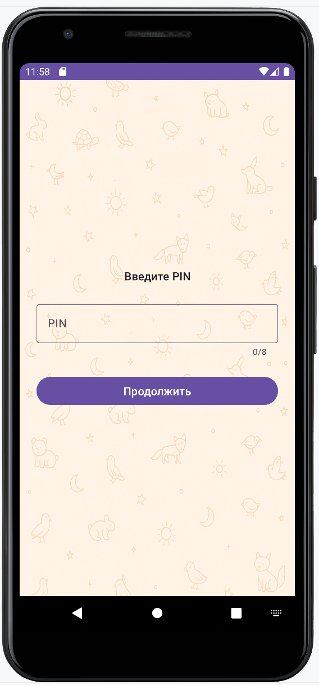
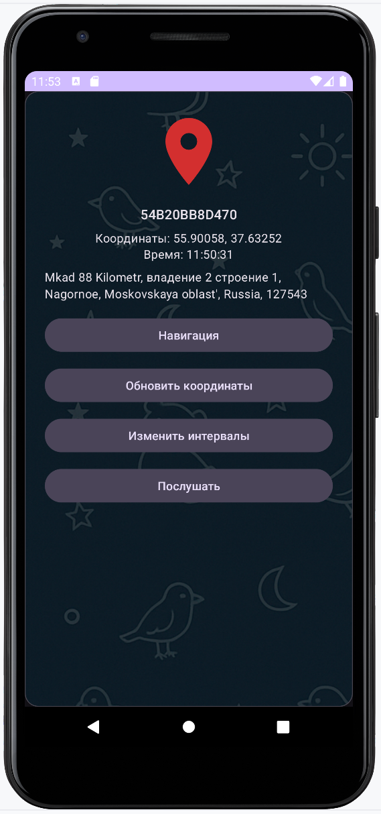

# SafeOrbit

[](https://github.com/your-username/safeorbit/actions)
[](LICENSE)
[](https://developer.android.com/)
[](https://kotlinlang.org/)

**SafeOrbit** is a Kotlin-based Android application that allows two smartphones to securely connect and interact in real time using Firebase as the backend. The app is designed for private tracking and remote monitoring between trusted users — one device acts as a **Server** and the other as a **Client**.

---

## ✨ Features

- 🔐 Role selection on first launch: **Server** or **Client**
- 📍 Real-time location tracking of the Server device on a map
- 🎙️ Remote microphone access: Clients can request audio from the Server
- 🔋 Smart power-saving location updates (based on device movement, step counting, and user-configurable inactivity period)
- 📁 Firebase Realtime Database and Storage integration
- 🔗 Firebase-based pairing using custom **ID** and **Code**
- 🖼️ Custom server icons (upload from camera/gallery)
- 🧭 Navigation to the server's last known location (via Google Maps or Yandex.Maps)
- 🧠 Historical activity log (with step count, movement mode, and distance)
- 🌗 Dark/light theme support
- 👥 One Client can link to multiple Servers

---

## 📲 Use Cases

- Monitoring a child's or loved one's device location
- Personal safety and awareness
- Lightweight alternative to commercial GPS trackers
- Private and consent-based audio monitoring

---

## 📸 Screenshots

| 🎮 Role Selection              | 📡 Client Mode (Map & Audio)     |
|-------------------------------|----------------------------------|
|    |       |

| 🧾 Server Details in Client     | 🗺️ Server Location on Map        |
|--------------------------------|----------------------------------|
|     |       |

| 🔐 Server Settings (PIN Lock)  | 🛠️ Server Configuration Options  |
|--------------------------------|----------------------------------|
|     |       |

| 🌙 Night Mode (Dark Theme)     |                                  |
|--------------------------------|----------------------------------|
|     |                                  |

---

## 🛠️ Technologies Used

- **Kotlin + MVVM architecture**
- **Firebase Authentication** (anonymous sign-in)
- **Firebase Realtime Database** (real-time sync)
- **Firebase Storage** (audio uploads)
- **Google Maps SDK** (or Yandex MapKit)
- **Fused Location Provider** (for GPS)
- **SensorManager** (step counter integration)
- **WorkManager & Foreground Services**
- **Room Database** (for local activity history)
- **Hilt (Dependency Injection)**

---

## 🚀 Getting Started

### 1. Clone the repository

```bash
git clone https://github.com/wizand0/safeorbit.git
```

### 2. Open in Android Studio
- Open the project in Android Studio
- Make sure your google-services.json is placed in the app/ folder
- Enter your api key in local.properties (YANDEX_MAPKIT_API_KEY=your_key)

### 3. Set up Firebase
- Enable:
- Anonymous Authentication
- Realtime Database (with custom rules)
- Storage (optional: for audio files)

## 🔒 Firebase Rules (Example)
```
{
  "rules": {
    "users": {
      "$uid": {
        ".read": "$uid === auth.uid",
        ".write": "$uid === auth.uid"
      }
    },
    "servers": {
      "$serverId": {
        ".read": "auth != null && root.child('servers').child($serverId).child('owner').val() === auth.uid",
        ".write": "auth != null && root.child('servers').child($serverId).child('owner').val() === auth.uid"
      }
    },
    "clients": {
      "$clientId": {
        ".read": "$clientId === auth.uid",
        ".write": "$clientId === auth.uid"
      }
    }
  }
}

```

## 📄 License
This project is open-source and available under the MIT License.

## 🙌 Contributions
Pull requests are welcome. For major changes, please open an issue first to discuss what you would like to change.